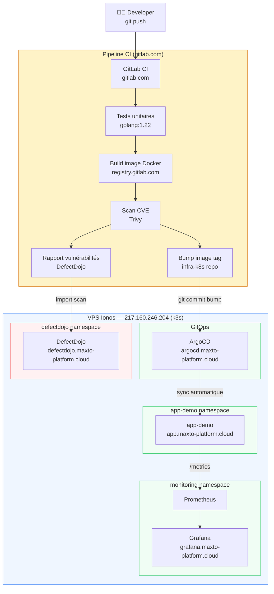

# Maxto Platform — Stack GitOps Lab

> Pipeline de livraison logicielle complet et autonome, du commit au déploiement, avec sécurité et observabilité intégrées.

---

## Architecture



---

## Le parcours d'un commit

```
git push
  └── GitLab CI
        ├── 1. unit-tests       → go test ./...
        ├── 2. build-image      → docker build + push registry.gitlab.com
        ├── 3. trivy-scan       → scan CVE (CRITICAL bloquant)
        ├── 4. upload-defectdojo→ rapport JSON → DefectDojo
        └── 5. update-manifests → bump image tag dans infra-k8s

ArgoCD détecte le changement dans infra-k8s
  └── Déploie automatiquement sur k3s
        └── App live sur https://app.maxto-platform.cloud
```

---

## Stack technique

| Couche | Outil | URL |
|--------|-------|-----|
| Orchestration | k3s (Kubernetes) | VPS Ionos 4vCPU/8Go |
| CI/CD | GitLab CI | gitlab.com/Mtoris |
| GitOps | ArgoCD | http://argocd.maxto-platform.cloud |
| Registry | GitLab Registry | registry.gitlab.com/mtoris |
| Scan CVE | Trivy | intégré pipeline |
| Gestion vulnérabilités | DefectDojo | https://defectdojo.maxto-platform.cloud |
| Métriques | Prometheus + Grafana | http://grafana.maxto-platform.cloud |
| TLS | cert-manager + Let's Encrypt | automatique |
| Ingress | nginx-ingress | hostPort 80/443 |

---

## Repos

| Repo | Rôle |
|------|------|
| [platform-config](https://gitlab.com/Mtoris/platform-config) | ArgoCD App of Apps — source de vérité GitOps |
| [infra-k8s](https://gitlab.com/Mtoris/infra-k8s) | Manifests Kubernetes (deployments, services, ingress) |
| [app-demo](https://gitlab.com/Mtoris/app-demo) | Microservice Go + pipeline CI/CD complet |

---

## Sécurité by design

- Aucun accès direct au cluster — tout passe par ArgoCD
- Chaque image scannée par Trivy avant déploiement
- CVE centralisées dans DefectDojo avec historique
- Secrets dans Kubernetes Secrets, jamais dans le code
- TLS automatique via cert-manager + Let's Encrypt

---

## Auteur

**Maxime Toris** — Platform Engineer / SRE  
📧 toris.maxime@gmail.com  
🔗 [GitLab](https://gitlab.com/Mtoris)
